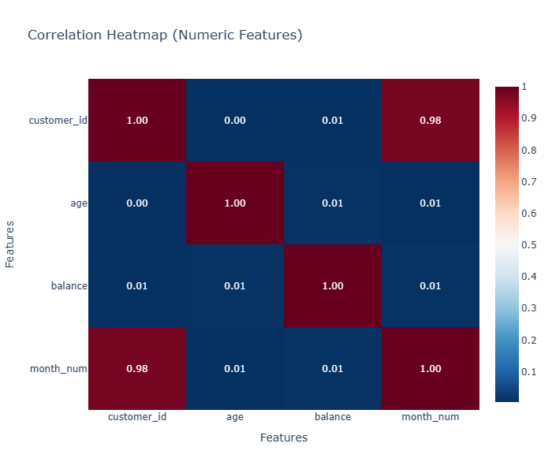

# American Bank Customer Analysis:

## Project Summary
This project focuses on exploratory data analysis (EDA) of customer account balances to uncover meaningful financial patterns across demographics, geography, time, and loan status. Using a combination of visualizations—including bar charts, pie charts, choropleth maps, growth charts, stacked charts, and correlation heatmaps—the analysis provides insights into customer financial behavior.

The study highlights which states contribute the most balances, how gender and marital status affect financial distribution, the role of job classifications, seasonal variations in monthly balances, and how different loan types interact with account balances. The findings reveal strong imbalances, such as California’s dominance in state balances, married customers holding the largest share, and white-collar jobs driving over half of total balances.

By combining these insights, the project builds a clear financial profile of the customer base and identifies areas where institutions can optimize marketing, risk management, and product offerings.

---

## Problem Statement
- Financial institutions often manage large volumes of customer data but struggle to understand balance distribution patterns across different customer groups and time periods. Without such insights, it becomes challenging to:
- Identify high-value customer segments.
- Predict growth opportunities.
- Design targeted financial products.
- Optimize resource allocation for customer acquisition and retention.

Thus, the problem addressed in this project is: *How can exploratory data analysis of customer demographics, geography, and loan status uncover balance distribution patterns to support better decision-making in financial services?*

---

## Objectives
- Geographic Analysis – Identify which states contribute the highest balances and visualize regional disparities.
- Demographic Insights – Analyze how gender, marital status, and job classification impact balance distribution.
- Loan Analysis – Compare balances between customers with house loans and other loans to assess debt–balance relationships.
- Time-Series Trends – Track monthly balance growth to detect seasonal peaks and long-term trends.
- Correlation Analysis – Investigate numeric feature relationships to identify hidden dependencies or dataset artifacts.
- Growth Prioritization – Use Pareto-style growth charts to highlight which customer groups drive the largest share of total balances.
```.py
import pandas as pd
import numpy as np
import matplotlib.pyplot as plt
import seaborn as sns
import plotly.express as px
import plotly.io as pio
```
```.py
df = pd.read_csv(r'C:\Users\santa\Downloads\Ab\AmericanBank.csv')

```
```.py
df.head(3)

Customer ID	Full Name	Gender	Age	State	Job Classification	Date Joined	Balance	marital	education	houseloan	otherloan	contact	poutcome	Loan Default
0	1	Christy Olson	Male	21	California	White Collar	05.Jan.2017	$169,864.42	married	primary	no	no	cellular	unknown	no
1	2	Dan Peterson	Female	34	Oregon	Blue Collar	06.Jan.2017	$55,102.60	married	secondary	yes	yes	cellular	failure	no
2	3	Mable Lindsey	Male	46	California	White Collar	07.Jan.2017	$151,546.03	single	tertiary	yes	no	cellular	failure	no
```
```.py
df.columns
Index(['Customer ID', 'Full Name', 'Gender', 'Age', 'State',
       'Job Classification', 'Date Joined', ' Balance ', 'marital',
       'education', 'houseloan', 'otherloan', 'contact', 'poutcome',
       'Loan Default'],
      dtype='object')
```
```py
df.columns = df.columns.str.strip().str.lower()
df = df.rename(columns={
    'customer id'     : 'customer_id',
    'full name'       : 'full_name',
    'job classification': 'job_classification',
    'date joined'     : 'date_joined',
    ' balance '       : 'balance',
    'loan default'    : 'loan_default'
})
```
```py
df.columns
Index(['customer_id', 'full_name', 'gender', 'age', 'state',
       'job_classification', 'date_joined', 'balance', 'marital', 'education',
       'houseloan', 'otherloan', 'contact', 'poutcome', 'loan_default'],
      dtype='object')
```
```py
df.info()
<class 'pandas.core.frame.DataFrame'>
RangeIndex: 3994 entries, 0 to 3993
Data columns (total 15 columns):
 #   Column              Non-Null Count  Dtype 
---  ------              --------------  ----- 
 0   customer_id         3994 non-null   int64 
 1   full_name           3994 non-null   object
 2   gender              3994 non-null   object
 3   age                 3994 non-null   int64 
 4   state               3994 non-null   object
 5   job_classification  3994 non-null   object
 6   date_joined         3994 non-null   object
 7   balance             3994 non-null   object
 8   marital             3994 non-null   object
 9   education           3994 non-null   object
 10  houseloan           3994 non-null   object
 11  otherloan           3994 non-null   object
 12  contact             3994 non-null   object
 13  poutcome            3994 non-null   object
 14  loan_default        3994 non-null   object
dtypes: int64(2), object(13)
memory usage: 468.2+ KB
```
```py
df.describe()
customer_id	age
count	3994.000000	3994.000000
mean	1997.500000	38.584126
std	1153.112816	9.806700
min	1.000000	15.000000
25%	999.250000	31.000000
50%	1997.500000	37.000000
75%	2995.750000	45.000000
max	3994.000000	64.000000
```
#### Remove '$' and ',' from the 'balance' column and convert it to numeric
```py
df['balance'] = df['balance'].astype(str).str.replace('$', '').str.replace(',', '', regex=False)
df['balance'] = pd.to_numeric(df['balance'])
```
#### Make sure sum only the 'balance' column
```py
total_balance = df['balance'].sum()
```
---

## Analytical Calculation
#### Total Balance:
```py
print("Total balance: {:,.2f}".format(total_balance))
Total balance: 236,926,531.58
```
#### Total Customers:
```py
total_customers = df.shape[0]
print("Total customers:", total_customers)
Total customers: 3994
```
#### Total Customers by States:
```py
customer_count = df['state'].value_counts().reset_index()
customer_count.columns = ['state', 'total_customers']
print(customer_count)
        state  total_customers
0  California             2152
1      Nevada             1115
2     Wyoming              516
3      Oregon              211
```
#### Total Customers by Marital Status:
```py
df['marital'].value_counts()
marital
married     2486
single      1054
divorced     454
Name: count, dtype: int64
```
#### Average Balance:
```py
avg_balance = df['balance'].mean()
print("Average balance: {:,.2f}".format(avg_balance))
Average balance: 59,320.61
```
#### Total Customers by Genders:
```py
gender_counts = df['gender'].value_counts().reset_index()
gender_counts.columns = ['gender', 'total_customers']
print(gender_counts)
   gender  total_customers
0    Male             2152
1  Female             1842
```
#### Total balance by gender:
```py
gender_balance = df.groupby('gender')['balance'].sum().reset_index()
print(gender_balance)
   gender       balance
0  Female  1.083359e+08
1    Male  1.285906e+08
```
#### Total balance by job classification:
```py
job_balance = df.groupby('job_classification')['balance'].sum().reset_index()
print(job_balance)
  job_classification       balance
0        Blue Collar  6.125762e+07
1              Other  5.955568e+07
2       White Collar  1.161132e+08
```
#### Make sure date_joined is datetime
```py
df['date_joined'] = pd.to_datetime(df['date_joined'], errors='coerce')
```
#### Create new columns
```py
df['month_num'] = df['date_joined'].dt.month
df['month_name'] = df['date_joined'].dt.strftime('%B')   # Full month name
```
```py
df.head(5)
customer_id	full_name	gender	age	state	job_classification	date_joined	balance	marital	education	houseloan	otherloan	contact	poutcome	loan_default	month_num	month_name
0	1	Christy Olson	Male	21	California	White Collar	2017-01-05	169864.42	married	primary	no	no	cellular	unknown	no	1	January
1	2	Dan Peterson	Female	34	Oregon	Blue Collar	2017-01-06	55102.60	married	secondary	yes	yes	cellular	failure	no	1	January
2	3	Mable Lindsey	Male	46	California	White Collar	2017-01-07	151546.03	single	tertiary	yes	no	cellular	failure	no	1	January
3	4	Kyle Carr	Male	32	Wyoming	White Collar	2017-01-08	2120.19	married	tertiary	yes	yes	unknown	unknown	no	1	January
4	5	Rachel Gomez	Female	38	California	Blue Collar	2017-01-09	53192.24	married	secondary	yes	no	unknown	unknown	no	1	January
```
#### Create CSV file
```py
df.to_csv("AB_final.csv", index=False)
```
```py
df.columns
Index(['customer_id', 'full_name', 'gender', 'age', 'state',
       'job_classification', 'date_joined', 'balance', 'marital', 'education',
       'houseloan', 'otherloan', 'contact', 'poutcome', 'loan_default',
       'month_num', 'month_name'],
      dtype='object')
```
---
## EDA:

### 1. Total Balance Distribution Across U.S. States
- Goal: Compare the total account balances across U.S. states to identify which states hold the highest financial balance concentration.                                          
- Chart: Choropleth Map – showing geographic distribution of balances by U.S. state. Bar Chart – ranking states by their total balance with values labeled.
- EDA Type: Bivariate (categorical: State vs. numerical: Balance).                                                                                                       
- Structure: The map uses a color gradient (yellow = high, purple = low) to visually show balance intensity per state. The bar chart displays four states explicitly: California (130M), Nevada (66M), Wyoming (33M), and Oregon (12M). Values are annotated above the bars for easy comparison.

```py
import pandas as pd
import plotly.express as px

# Mapping full state names -> 2-letter codes
us_state_abbrev = {
    'Alabama':'AL','Alaska':'AK','Arizona':'AZ','Arkansas':'AR','California':'CA',
    'Colorado':'CO','Connecticut':'CT','Delaware':'DE','Florida':'FL','Georgia':'GA',
    'Hawaii':'HI','Idaho':'ID','Illinois':'IL','Indiana':'IN','Iowa':'IA',
    'Kansas':'KS','Kentucky':'KY','Louisiana':'LA','Maine':'ME','Maryland':'MD',
    'Massachusetts':'MA','Michigan':'MI','Minnesota':'MN','Mississippi':'MS',
    'Missouri':'MO','Montana':'MT','Nebraska':'NE','Nevada':'NV','New Hampshire':'NH',
    'New Jersey':'NJ','New Mexico':'NM','New York':'NY','North Carolina':'NC',
    'North Dakota':'ND','Ohio':'OH','Oklahoma':'OK','Oregon':'OR','Pennsylvania':'PA',
    'Rhode Island':'RI','South Carolina':'SC','South Dakota':'SD','Tennessee':'TN',
    'Texas':'TX','Utah':'UT','Vermont':'VT','Virginia':'VA','Washington':'WA',
    'West Virginia':'WV','Wisconsin':'WI','Wyoming':'WY'
}

# Add abbreviation column
df["state_code"] = df["state"].map(us_state_abbrev)

# Aggregate total balance
state_balance = df.groupby(["state", "state_code"])["balance"].sum().reset_index()

# Choropleth map
fig_map = px.choropleth(
    state_balance,
    locations="state_code",
    locationmode="USA-states",
    color="balance",
    hover_name="state",
    color_continuous_scale="Viridis",
    scope="usa",
    title="Total Balance by US State"
)

# Save map
fig_map.write_image("total_balance_map.png")

# Bar chart with labels
fig_bar = px.bar(
    state_balance.sort_values("balance", ascending=False),
    x="state",
    y="balance",
    text="balance",  
    title="Total Balance by State (Bar Chart)"
)

fig_bar.update_traces(
    texttemplate='%{text:.2s}',   # short format (e.g. 1.2M)
    textposition='outside'        
)

fig_bar.update_layout(
    uniformtext_minsize=8,
    uniformtext_mode='hide',
    yaxis_title="Total Balance",
    xaxis_title="State"
)

# Save bar chart
fig_bar.write_image("total_balance_bar.png")

# Show both interactive charts
fig_map.show()
fig_bar.show()
```


#### Insights:
- California dominates with nearly double the balance of Nevada, indicating it is the largest concentration of funds.
- Nevada holds a strong second position but far behind California.
- Wyoming and Oregon lag significantly, holding comparatively minor balances.
- The geographical visualization reinforces that the western states carry the majority of balances in this dataset.

---

### 2. Balance Distribution by Gender
- Goal: Understand how total account balances are distributed between male and female customers.
- Chart: Donut Pie Chart – dividing total balance into male and female proportions.
- EDA Type: Univariate categorical analysis (Gender → Balance).
- Structure: Two categories: Male and Female. Male: 128.6M (54.3%) shown in blue. Female: 108.3M (45.7%) shown in red. Percentage labels and exact values are displayed inside the chart for clarity.

```py
import plotly.express as px

# Aggregate balance by gender
gender_balance = df.groupby("gender")["balance"].sum().reset_index()

# Pie chart
fig_pie = px.pie(
    gender_balance,
    names="gender",
    values="balance",
    title="Balance Distribution by Gender",
    hole=0.3  # makes it a donut-style chart (optional)
)

# Add labels (percent + value)
fig_pie.update_traces(
    textinfo="percent+label+value",
    pull=[0.05, 0]  # slightly pull out first slice for emphasis
)

# Save as PNG
fig_pie.write_image("balance_by_gender_pie.png")

# Show chart
fig_pie.show()
Insights:
Males hold a slightly higher share of the total balance, accounting for more than half (54.3%).

Females hold a substantial share (45.7%), indicating relatively balanced financial representation.

The gap is not very wide, suggesting both genders contribute almost equally to the total balance pool.

3. Balance Distribution by Job Classification
Goal: Analyze how total balances are distributed across different job classifications (White Collar, Blue Collar, and Other).

Chart: Donut Pie Chart – showing share of balance by job categories.

EDA Type: Univariate categorical analysis (Job Classification → Balance).

Structure:

White Collar: 116.1M (49%) – represented in blue.

Blue Collar: 61.3M (25.9%) – represented in red.

Other: 59.6M (25.1%) – represented in green.

Percentages and amounts displayed inside the chart; legend provided for category clarity.

import plotly.express as px

# Aggregate balance by job classification
job_balance = df.groupby("job_classification")["balance"].sum().reset_index()

# Pie chart
fig_job_pie = px.pie(
    job_balance,
    names="job_classification",
    values="balance",
    title="Balance Distribution by Job Classification",
    hole=0.3  # donut-style, looks cleaner with many categories
)

# Add labels: percent + actual value
fig_job_pie.update_traces(
    textinfo="percent+label+value",
    textposition="inside"
)

# Save as PNG
fig_job_pie.write_image("balance_by_job_classification_pie.png")

# Show chart
fig_job_pie.show()
```

#### Insights:
- White Collar employees dominate the distribution, holding nearly half of the total balances (49%).
- Blue Collar and Other groups contribute almost equally (about one-quarter each).
- The distribution highlights a skew towards White Collar customers, suggesting they manage higher balances compared to others.

---
  
### 4. Balance Distribution by Marital Status
- Goal: Evaluate how total balances are distributed among customers based on their marital status (married, single, divorced).
- Chart: Donut Pie Chart – visualizing balance contributions by marital categories.
- EDA Type: Univariate categorical analysis (Marital Status → Balance).
- Structure: Married: 146.8M (62%) – highlighted in blue and visually pulled out to emphasize dominance. Single: 62.8M (26.5%) – shown in red. Divorced: 27.4M (11.5%) – shown in green. Labels include exact amounts and percentages for clarity.

```py
import plotly.express as px

# Aggregate balance by marital status
marital_balance = df.groupby("marital")["balance"].sum().reset_index()

# Donut chart
fig_marital = px.pie(
    marital_balance,
    names="marital",
    values="balance",
    hole=0.4,   # makes it donut-shaped
    title="Balance Distribution by Marital Status"
)

# Add labels: percentage + value
fig_marital.update_traces(
    textinfo="percent+label+value",
    pull=[0.05]*len(marital_balance)  # slightly pull all slices for emphasis
)

# Save as PNG
fig_marital.write_image("balance_by_marital_status_donut.png")

# Show chart
fig_marital.show()
```

#### Insights:
- Married customers overwhelmingly dominate the balance distribution, holding nearly two-thirds (62%) of the total.
- Singles account for about a quarter (26.5%), while divorced customers contribute the smallest share (11.5%).
- The sharp dominance of the married group suggests a strong correlation between marital stability and higher financial balances.

---

### 5. Total Balance by Month
- Goal: Track the month-wise trend of total balances to identify growth patterns, seasonal peaks, and fluctuations over the year.
- Chart: Combined Bar + Line Chart – bars show monthly totals, line overlays the trend progression.
- EDA Type: Time-series analysis (Univariate numerical variable over time).
- Structure: X-axis - Months (January to December). Y-axis - Total Balance (in millions). Bars - Monthly total balances ranging from 1.8M (February) to 34M (September). Line - Overlaid trend line (red) connects monthly values to highlight changes and direction.

```py
import plotly.express as px

# Aggregate balance by month
month_balance = df.groupby(["month_num", "month_name"])["balance"].sum().reset_index()

# Sort by month_num to keep order
month_balance = month_balance.sort_values("month_num")

# Line + bar combo chart
fig_month = px.bar(
    month_balance,
    x="month_name",
    y="balance",
    text="balance",
    title="Total Balance by Month",
    labels={"month_name": "Month", "balance": "Total Balance"}
)

# Add a line trace on top of bars
fig_month.add_scatter(
    x=month_balance["month_name"],
    y=month_balance["balance"],
    mode="lines+markers",
    name="Trend"
)

# Style labels
fig_month.update_traces(
    texttemplate='%{text:.2s}',   # short format (e.g. 1.2M, 530K)
    textposition="outside",
    selector=dict(type="bar")
)

# Save as PNG
fig_month.write_image("balance_by_month_line_bar.png")

# Show interactive chart
fig_month.show()
```

#### Insights:
- Balances were very low in the first quarter (below 3M through February–March).
- A sharp increase began in April (12M) and peaked in September (34M).
- The last quarter (October–December) stabilized around 30M, maintaining strong totals after the September peak.
- The chart reveals both seasonal growth and sustained momentum, suggesting a major driver of account activity in mid-year (likely business cycles, campaigns, or customer onboarding).

---

### 6. Growth Chart – Balance by Job Classification
- Goal: Identify how different job classifications contribute cumulatively to total balances, highlighting which groups drive the largest share of growth.
- Chart: Pareto-style Combo Chart – Bars show balances by job type, and a cumulative growth line (percentage) highlights cumulative contribution.
- EDA Type: Multivariate analysis (categorical variable vs. balance with cumulative percentage).
- Structure: X-axis - Job Classification (White Collar, Blue Collar, Other). Left Y-axis - Total Balance (absolute values shown above bars). Right Y-axis-  Cumulative % (growth contribution). Bars: White Collar = 116.1M, Blue Collar = 61.3M, Other = 59.6M. Line - Cumulative growth percentage rising from ~55% (after White Collar) to 100% (after Other).

```py
import pandas as pd
import plotly.graph_objects as go

# Aggregate balance by job classification
job_balance = df.groupby("job_classification")["balance"].sum().reset_index()

# Sort by balance descending
job_balance = job_balance.sort_values("balance", ascending=False)

# Calculate cumulative percentage
job_balance["cumulative_balance"] = job_balance["balance"].cumsum()
job_balance["cumulative_pct"] = 100 * job_balance["cumulative_balance"] / job_balance["balance"].sum()

# Create figure
fig_growth = go.Figure()

# Bar chart for balances
fig_growth.add_trace(go.Bar(
    x=job_balance["job_classification"],
    y=job_balance["balance"],
    text=job_balance["balance"],
    textposition="outside",
    name="Balance"
))

# Line chart for cumulative %
fig_growth.add_trace(go.Scatter(
    x=job_balance["job_classification"],
    y=job_balance["cumulative_pct"],
    mode="lines+markers",
    name="Cumulative % (Growth)",
    yaxis="y2"  # secondary y-axis
))

# Layout with secondary axis
fig_growth.update_layout(
    title="Growth Chart: Balance by Job Classification",
    xaxis_title="Job Classification",
    yaxis=dict(title="Total Balance"),
    yaxis2=dict(title="Cumulative %", overlaying="y", side="right", range=[0, 110]),
    bargap=0.3
)

# Save as PNG
fig_growth.write_image("growth_chart_balance_by_job_classification.png")

# Show chart
fig_growth.show()
```

#### Insights:
- White Collar employees alone contribute over half of the total balances (~55%), establishing them as the dominant group.
- Blue Collar adds another ~29%, pushing the cumulative contribution above 80%.
- “Other” group contributes the remaining ~20%, completing the distribution.
- The growth chart clearly shows a Pareto-like effect: a small segment (White Collar) drives the majority of balances.

---

### 7. Balance by House Loan and Other Loan
- Goal: Compare total balances between customers with and without house loans, while also analyzing how “other loans” affect those balances.
- Chart: Stacked Bar Chart – primary grouping by house loan status, stacked segments for other loan status.
- EDA Type: Multivariate categorical analysis (House Loan × Other Loan → Balance).
- Structure: X-axis - House Loan categories (Yes / No). Y-axis - Total Balance (in millions).
- Bars: House Loan = No → 90M (no other loan) + 15M (with other loan) = 105M total. House Loan = Yes → 110M (no other loan) + 20M (with other loan) = 130M total.
- Colors: Blue = no other loan, Red = yes other loan. Values displayed inside each segment.

```py
import plotly.express as px

# Aggregate balance by house loan and other loan
loan_balance = df.groupby(["houseloan", "otherloan"])["balance"].sum().reset_index()

# Stacked bar chart
fig_stack = px.bar(
    loan_balance,
    x="houseloan",
    y="balance",
    color="otherloan",
    text="balance",
    title="Balance by House Loan and Other Loan",
    labels={"houseloan": "House Loan", "otherloan": "Other Loan", "balance": "Total Balance"},
    barmode="stack"
)

# Style labels
fig_stack.update_traces(
    texttemplate='%{text:.2s}',   # short form like 1.2M
    textposition="inside"
)

fig_stack.update_layout(
    yaxis_title="Total Balance",
    xaxis_title="House Loan",
    legend_title="Other Loan"
)

# Save as PNG
fig_stack.write_image("balance_by_houseloan_otherloan_stacked.png")

# Show interactive chart
fig_stack.show()
```

#### Insights:
- Customers with house loans contribute the majority of balances (130M vs 105M).
- Within each group, balances without other loans are significantly higher than with other loans.
- “Other loans” contribute only a small fraction (15–20M), suggesting they play a limited role in overall balances.
- The dominance of house loan holders suggests strong links between homeownership and higher account balances.

---

### 8. Correlation Heatmap of Numeric Features
- Goal: Examine the relationships between numerical features in the dataset to detect patterns, redundancies, or dependencies.
- Chart: Heatmap – displaying pairwise correlation values between numeric variables.
- EDA Type: Correlation analysis (Multivariate numeric relationships).
- Structure: Features compared: customer_id, age, balance, month_num.
- Color scale: Blue (low/negative correlation) → Red (high/positive correlation).
- Diagonal values = 1 (self-correlation).
- Key correlations shown numerically inside cells.

```py
import plotly.express as px

# Select numeric columns
numeric_df = df.select_dtypes(include="number")

# Compute correlation
corr = numeric_df.corr()

# Convert to long format for Plotly
corr_long = corr.reset_index().melt(id_vars="index")
corr_long.columns = ["Feature1", "Feature2", "Correlation"]

# Interactive heatmap
fig_corr = px.imshow(
    corr, 
    text_auto=".2f",              # show values inside cells
    color_continuous_scale="RdBu_r", # red = negative, blue = positive
    aspect="auto",
    title="Correlation Heatmap (Numeric Features)"
)

fig_corr.update_layout(
    xaxis_title="Features",
    yaxis_title="Features",
    xaxis_showgrid=False,
    yaxis_showgrid=False,
    width=700,
    height=600
)

# Save as PNG
fig_corr.write_image("correlation_heatmap_numeric_interactive.png")

fig_corr.show()
```

Insights:
- Customer_id vs. Month_num: Very high correlation (0.98) – suggesting customer IDs were likely generated sequentially by month. This is more of a dataset artifact than a meaningful relationship.
- Balance vs. Age: No significant correlation (~0.01) – balance does not depend directly on customer age in this dataset.
- Balance vs. Month_num: Very weak correlation (~0.01) – balances do not follow a strict monthly progression.
- Overall finding: Aside from the artificial ID–month relationship, numeric features are largely independent, which is good for unbiased analysis.
